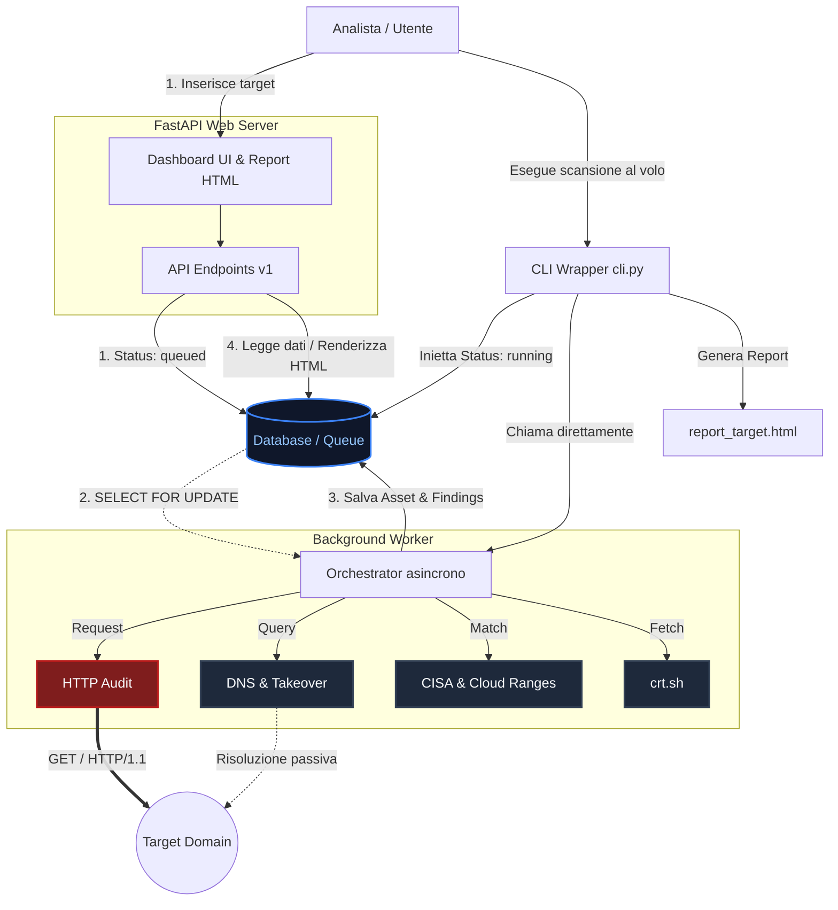

# Nexus-X | External Attack Surface Management (EASM)

Nexus-X è una piattaforma avanzata e modulare per l'**External Attack Surface Management**. Il suo obiettivo principale è mappare l'esposizione di un'infrastruttura (o di un target specifico) su Internet raccogliendo dati in modo passivo e semi-passivo.

---

## 🎯 1. Scopo della Piattaforma e Informazioni Raccolte

Lo scopo di Nexus-X è fornire ai team di sicurezza offensiva e difensiva una visione chiara degli asset esposti, identificare misconfigurazioni, analizzare la postura di sicurezza e rilevare potenziali vulnerabilità prima che possano essere sfruttate.

### 🔎 Come opera (Approccio OSINT e Stealth)
Nexus-X utilizza una batteria di **Collector** asincroni. La maggior parte di questi operano in maniera **100% Passiva (Zero-Touch Reconnaissance)** senza interagire in alcun modo con i server del target, affidandosi esclusivamente a OSINT e basi di dati pubbliche.

Le informazioni raccolte includono:
- **`crtsh` (Passivo):** Certificati SSL/TLS e domini/sottodomini associati estratti dai log di Certificate Transparency.
- **`whois_rdap` (Passivo):** Informazioni sui registrar, date di registrazione, nameserver e risoluzione base degli indirizzi IP.
- **`cloud_ranges` (Passivo):** Rilevamento automatico se gli IP del target sono ospitati su infrastrutture cloud pubbliche note (AWS, Google Cloud, Azure).
- **`dns` (Passivo):** Record A, AAAA, MX e TXT per analizzare la configurazione della posta (es. assenza di record SPF o DMARC).
- **`subdomain_takeover` (Passivo):** Verifica di record CNAME pendenti verso servizi di terze parti dismessi (es. GitHub Pages, Heroku, S3) vulnerabili a takeover.
- **`cisa_kev` (Passivo):** Verifica delle stringhe e dei software identificati contro il database federale CISA delle vulnerabilità attivamente sfruttate (Known Exploited Vulnerabilities).
- **`http_audit` (Semi-Attivo):** Questo modulo effettua una singola richiesta HTTP/HTTPS GET benigna al server web del target per estrarre gli header HTTP (come `Server`, `X-Powered-By`, e l'assenza di `Strict-Transport-Security`). *(Nota: Questa operazione lascerà traccia nei log di accesso del server remoto).*
- **`censys` (Passivo - Opzionale):** Integrazione con Censys Platform API v3 per una scoperta profonda degli asset globali.

Tutti i dati vengono immagazzinati, deduplicati in un inventario di "Asset" e analizzati per produrre "Security Findings" con relativa gravità e suggerimenti di remediation.

---

## 🚀 2. Comandi di Esecuzione

Nexus-X supporta due modalità di utilizzo parallele: una focalizzata sulla riga di comando per i test rapidi, e un'infrastruttura server per le dashboard e le integrazioni tramite API.

### Configurazione Iniziale (Requisito per entrambi i metodi)
Assicurati di aver configurato il tuo `.env` (o esportato le variabili d'ambiente) e attivato l'ambiente virtuale:
```bash
python3 -m venv .venv
source .venv/bin/activate
pip install -r requirements.txt

export APP_API_KEY="tua_chiave_super_segreta_minimo_32_caratteri"
export DATABASE_URL="sqlite:///./database/easm.db"
export EASM_ALLOWED_DOMAINS=""
export ALLOW_ARBITRARY_TARGETS="true"
```

### Metodo A: Utilizzo CLI (Modalità Tattica Rapida)
Ideale per gli analisti che vogliono scansionare un dominio al volo e ottenere un Report HTML estetico salvato direttamente nella cartella corrente, senza far partire alcun server.

```bash
# Esegue una scansione immediata, byapassa le code ed esporta il file HTML
python cli.py example.com
```

### Metodo B: Server Web + Background Worker (Modalità Produzione)
Ideale per l'utilizzo tramite Dashboard o integrazione API continua. Questa modalità utilizza FastAPI per esporre la dashboard e un processo asincrono per smaltire la coda del database.

1. **Avvia il Web Server (FastAPI):**
```bash
uvicorn app.main:app --host 127.0.0.1 --port 8000
```
2. **Avvia il Background Worker:** (In una nuova finestra del terminale, con lo stesso ambiente)
```bash
python -m app.worker
```
3. Apri il browser all'indirizzo **`http://127.0.0.1:8000/`**, inserisci la tua `APP_API_KEY` e gestisci i job di scansione tramite l'interfaccia grafica.

---

## 🏗 3. Diagrammi dell'Architettura

L'infrastruttura di Nexus-X è progettata in ottica asincrona e disaccoppiata (Decoupled Architecture), utilizzando PostgreSQL/SQLite come coda di messaggistica transazionale.



**Flussi di Riferimento del Diagramma:**
- 🔴 **Frecce spesse rosse (Semi-Attivo):** Indica un contatto diretto e visibile sui log del bersaglio.
- ⚪ **Frecce tratteggiate bianche (Passivo):** Operazione effettuata verso infrastrutture terze (es. DNS resolver, crt.sh) senza contatto col bersaglio.
- **Evitamento Race Condition:** La CLI bypassa lo stato `queued` registrando direttamente un job come `running` per evitare che il Worker di background le rubi l'esecuzione (Worker Stealing).
